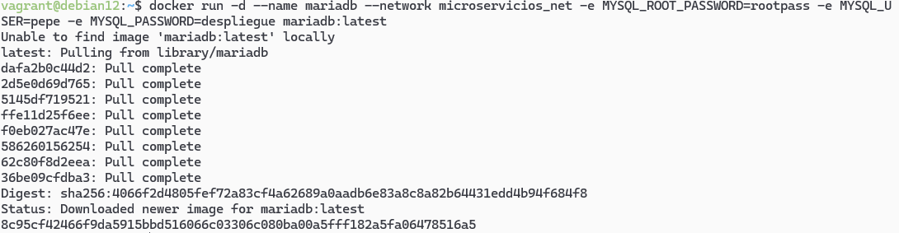
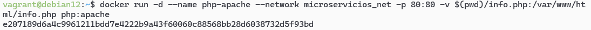
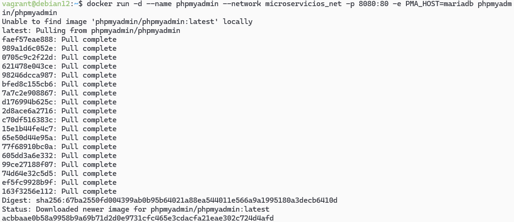
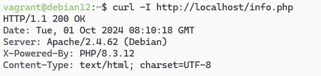

# Práctica Docker CLI

Esta practica consiste en crear un conjunto de microservicios con docker.

Para esta practica deberemos tener Vagrant y Docker instalado en nuestra maquina virtual.

## Iniciar la maquina

Dentro de nuestra máquina, deberemos dirigirnos a la carpeta Vagrant ``` cd /vagrant ``` para tener los archivos tanto en la máquina virtual como en nuestra máquina física.

# Los siguientes pasos los hemos automatizado con el provision.sh

## Crear la red interna

Creamos una red interna para que los contenedores puedan comunicarse entre sí:

```bash
docker network create microservicios_net
```

## Crear el contenedor MariaDB



```bash
docker run -d --name mariadb --network microservicios_net -e MYSQL_ROOT_PASSWORD=rootpass -e MYSQL_USER=pepe -e MYSQL_PASSWORD=despliegue mariadb:latest
```

## Creamos el archivo info.php

En este archivo deberemos escribir:

```php
<?php
phpinfo();
?>
```

## Crear el contenedor php-apache



```bash
docker run -d --name php-apache --network microservicios_net -p 80:80 -v $(pwd)/info.php:/var/www/html/info.php php:apache
```

## Crear el contenedor phpMyAdmin



```bash
docker run -d --name phpmyadmin --network microservicios_net -p 8080:80 -e PMA_HOST=mariadb phpmyadmin/phpmyadmin
```

# Comprobación de que todo funciona correctamente

Si ejecutamos el siguiente comando, nos mostrará el contenido de la pagina entera, lo que imprime `infophp()` en la pagina.

```bash
curl http://localhost/info.php/
```

Si ejecutamos el siguiente comando, mostrará el encabezado de la nuestro archivo así como un codigo de estado, 200 OK, que nos indica que todo está cargando correctamente.

```bash
curl -I http://localhost/info.php/
```


